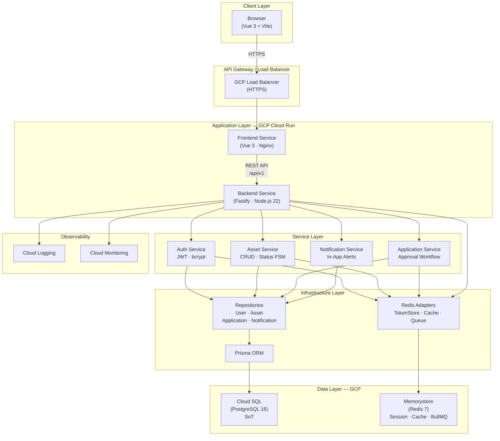

# Overall System Architecture

## Component Descriptions

| Component | Technology | Responsibility |
|-----------|-----------|----------------|
| Frontend Service | Vue 3, Vite, Element Plus, vue-i18n | UI, multi-language (zh-TW/en/ja/ko), role-based views |
| Backend Service | Fastify, TypeScript, Clean Architecture | REST API, business logic, JWT auth |
| Auth Service | bcrypt, JWT (RS256) | Login, registration, token refresh |
| Asset Service | Prisma | Asset CRUD, status transitions (AVAILABLE → IN_REPAIR → AVAILABLE/RETIRED) |
| Application Service | Prisma | Repair request lifecycle, approval workflow |
| Notification Service | Prisma | In-app notifications per application status change |
| Cloud SQL (PostgreSQL) | PostgreSQL 16 | Persistent relational data |
| Memorystore (Redis) | Redis 7 | Refresh session, token denylist, rate-limit, asset list cache, serial INCR, BullMQ (see [docs/redis.md](redis.md)) |
| Cloud Logging / Monitoring | GCP native | Structured logs, uptime alerts |

## Deployment Strategy

- **Frontend & Backend** deployed as separate Cloud Run services (independent scaling)
- **Zero-Downtime**: Cloud Run handles traffic splitting during new revision rollouts
- **Fault Tolerance**: Cloud Run auto-restarts unhealthy instances; Cloud SQL with read replica for HA
- **CI/CD**: GitHub Actions → build → test → push image to Artifact Registry → deploy to Cloud Run
