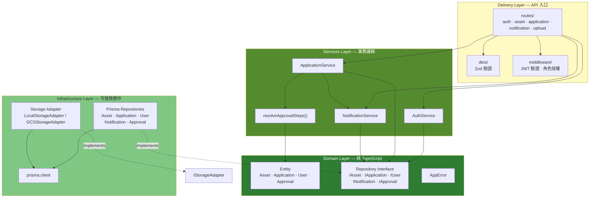
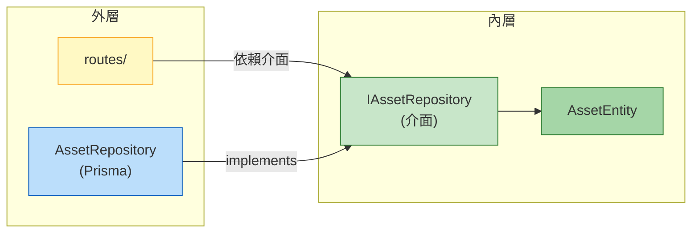
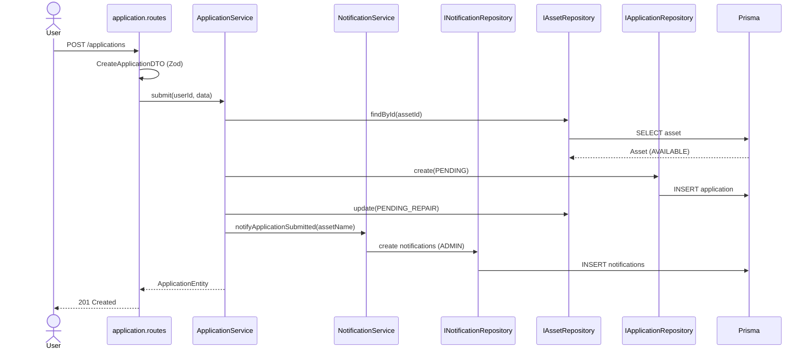

# Clean Architecture — Backend

後端採 **Clean Architecture 分層設計**：核心 Domain 不依賴框架，Infrastructure 實作 Domain 介面，Services 封裝業務邏輯，Routes 只負責 HTTP 入口。

---

## 分層總覽

---

## 依賴方向（Dependency Rule）

**規則：** 依賴只能由外指向內。Infrastructure 實作 Domain 介面，Services 只認識介面，不直接依賴 Prisma 或 Fastify。

---

## 各層職責

| 層 | 目錄 | 職責 | 框架依賴 |
|----|------|------|----------|
| **Delivery** | `routes/`, `dtos/`, `middleware/` | HTTP 路由、請求驗證、JWT 授權、錯誤轉 HTTP status | Fastify, Zod |
| **Services** | `services/` | 業務邏輯編排，可獨立單元測試 | 無 |
| **Domain** | `domain/` | Entity、Repository 介面、領域錯誤 | 無 |
| **Infrastructure** | `infrastructure/` | Prisma Repository、GCS / 本地儲存實作 | Prisma, GCS SDK |

---

## Services Layer 元件

| 元件 | 檔案 | 職責 |
|------|------|------|
| **AuthService** | `services/auth/auth.service.ts` | 登入、註冊、JWT 簽發與驗證 |
| **ApplicationService** | `services/application/application.service.ts` | 維修申請生命週期：提交、審核、維修、完成 |
| **resolveApprovalSteps** | `services/application/approvalRouter.service.ts` | 依資產類別決定審批步驟（ADMIN 一步 / SENIOR_ADMIN 兩步） |
| **NotificationService** | `services/notification/notification.service.ts` | 申請狀態變更時發送站內通知 |

---

## Domain Layer 元件

| 類型 | 元件 |
|------|------|
| **Entity** | `AssetEntity`, `ApplicationEntity`, `UserEntity`, `ApprovalEntity` |
| **Repository 介面** | `IAssetRepository`, `IApplicationRepository`, `IUserRepository`, `INotificationRepository`, `IApprovalRepository` |
| **錯誤** | `AppError`（NOT_FOUND / FORBIDDEN / CONFLICT） |

---

## Infrastructure Layer 元件

| 元件 | 說明 |
|------|------|
| `AssetRepository` | 實作 `IAssetRepository`，Prisma 存取 assets 表 |
| `ApplicationRepository` | 實作 `IApplicationRepository` |
| `UserRepository` | 實作 `IUserRepository`（含 `findIdsByRole`） |
| `NotificationRepository` | 實作 `INotificationRepository` |
| `ApprovalRepository` | 實作 `IApprovalRepository` |
| `LocalStorageAdapter` | 開發環境：`./uploads/` 本地存檔 |
| `GCSStorageAdapter` | 生產環境：Google Cloud Storage |
| `storage.factory.ts` | 依 `STORAGE_DRIVER` 切換 Storage 實作 |

---

## 請求流示例：提交維修申請

---

## 與簡報三欄圖的對照

| 簡報欄位 | 實際對應 |
|----------|----------|
| Domain — Entity | `domain/entities/*.entity.ts` |
| Domain — Repository 介面 | `domain/repositories/*.interface.ts` |
| Services — AuthService | ✅ 已實作 |
| Services — ApplicationService | ✅ 已實作（含審核流程） |
| Services — NotificationService | ✅ 已實作 |
| Infrastructure — Prisma Repository | ✅ 已實作 |
| Infrastructure — GCS Storage | ✅ 已實作（含 Local 開發替代） |
| Infrastructure — RedisTokenStore | ⬜ 規劃中（JWT 目前用 env secret） |

---

## 測試策略

| 層 | 測試方式 |
|----|----------|
| Services | 單元測試，mock Repository 介面（`*.service.test.ts`） |
| Routes | 整合測試，mock Service 或 Repository（`routes/__tests__/`） |
| Domain | 透過 Services 測試間接覆蓋；Entity 為純型別 |
