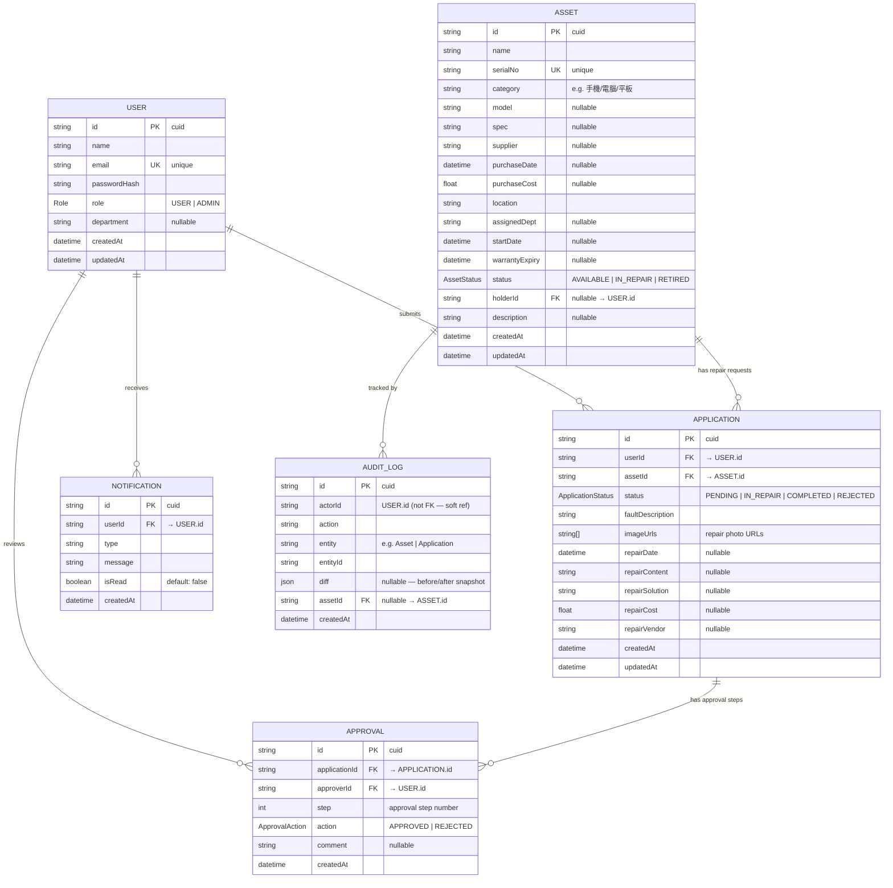

# Entity Relationship Diagram

## Enum Definitions

| Enum | Values |
|------|--------|
| `Role` | `USER`, `ADMIN` |
| `AssetStatus` | `AVAILABLE` (正常使用), `IN_REPAIR` (維修中), `RETIRED` (已報廢) |
| `ApplicationStatus` | `PENDING` (待審核), `IN_REPAIR` (審核通過/維修中), `COMPLETED` (維修完成), `REJECTED` (已拒絕) |
| `ApprovalAction` | `APPROVED`, `REJECTED` |

## Key Constraints

| Table | Constraint | Detail |
|-------|-----------|--------|
| `users` | UNIQUE | `email` |
| `assets` | UNIQUE | `serialNo` |
| `applications` | FK → `users` | `userId` (cascade on read) |
| `applications` | FK → `assets` | `assetId` |
| `approvals` | FK → `applications` | `applicationId` |
| `approvals` | FK → `users` | `approverId` |
| `notifications` | FK → `users` | `userId` |
| `audit_logs` | FK → `assets` | `assetId` (nullable) |
