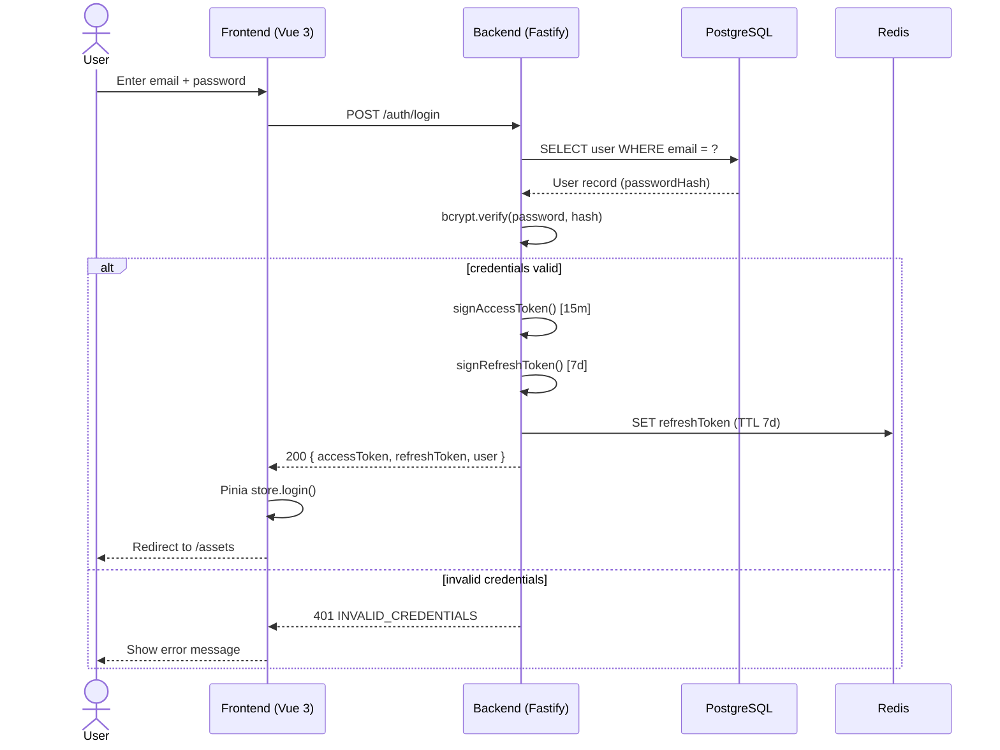
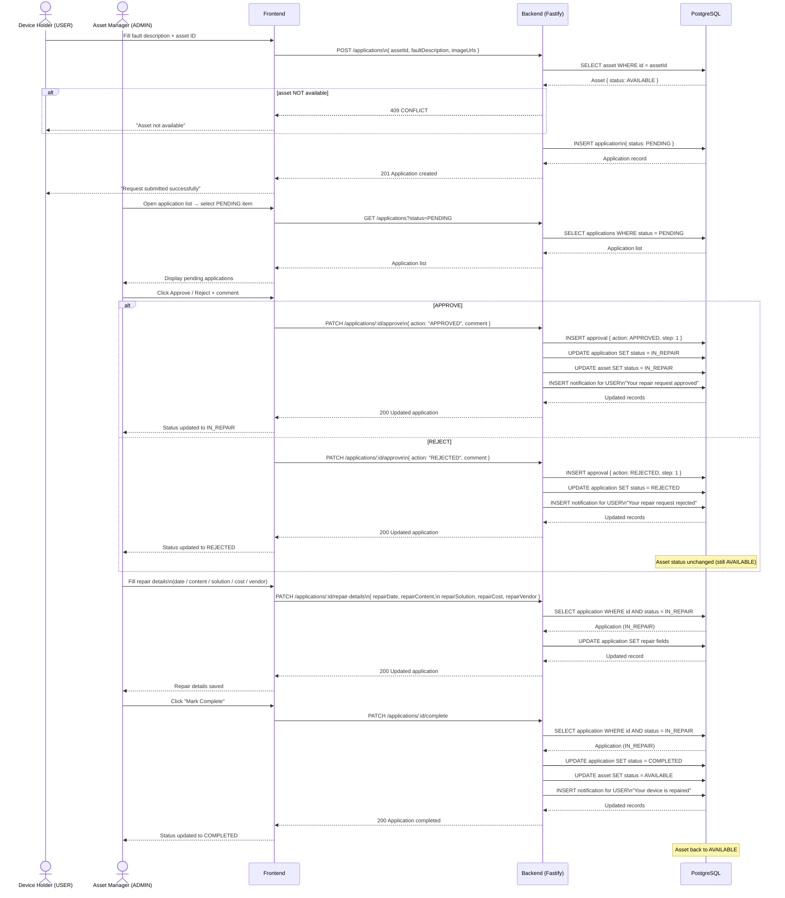
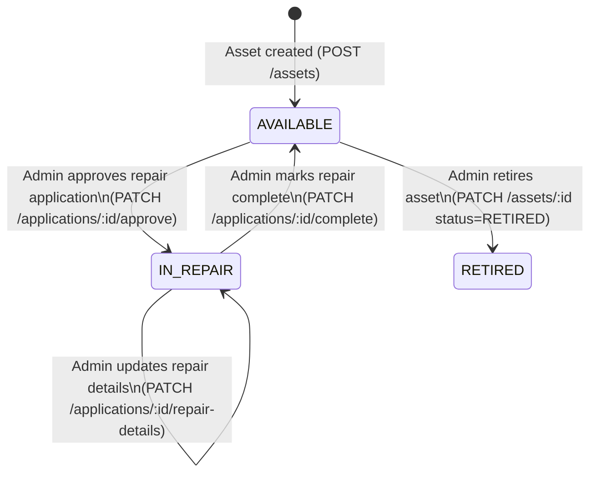
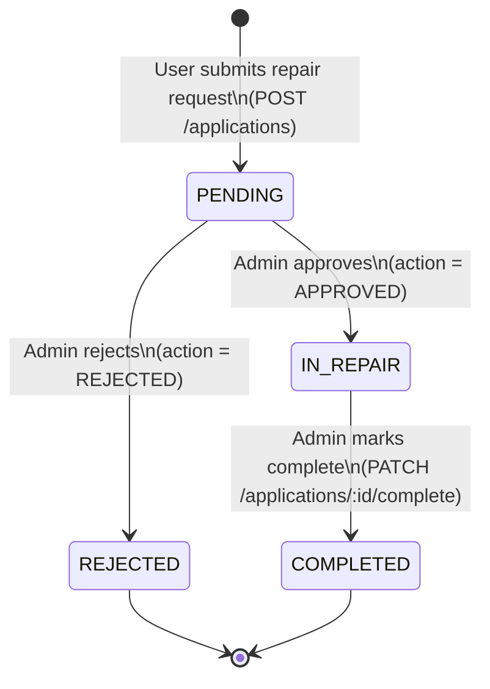

# Sequence Diagrams

## 1. User Login Flow

```mermaid
sequenceDiagram
    actor U as User
    participant FE as Frontend (Vue 3)
    participant BE as Backend (Fastify)
    participant DB as PostgreSQL
    participant Cache as Redis

    U->>FE: Enter email + password
    FE->>BE: POST /auth/login
    BE->>DB: SELECT user WHERE email = ?
    DB-->>BE: User record (passwordHash)
    BE->>BE: bcrypt.verify(password, hash)
    alt credentials valid
        BE->>BE: signAccessToken() [15m]
        BE->>BE: signRefreshToken() [7d]
        BE->>Cache: SET refreshToken (TTL 7d)
        BE-->>FE: 200 { accessToken, refreshToken, user }
        FE->>FE: Pinia store.login()
        FE-->>U: Redirect to /assets
    else invalid credentials
        BE-->>FE: 401 INVALID_CREDENTIALS
        FE-->>U: Show error message
    end
```

---

## 2. Asset Repair Application Flow (Core Business Flow)

```mermaid
sequenceDiagram
    actor USER as Device Holder (USER)
    actor ADMIN as Asset Manager (ADMIN)
    participant FE as Frontend
    participant BE as Backend (Fastify)
    participant DB as PostgreSQL

    %% ── Step 1: Submit Repair Request ──
    USER->>FE: Fill fault description + asset ID
    FE->>BE: POST /applications\n{ assetId, faultDescription, imageUrls }
    BE->>DB: SELECT asset WHERE id = assetId
    DB-->>BE: Asset { status: AVAILABLE }
    alt asset NOT available
        BE-->>FE: 409 CONFLICT
        FE-->>USER: "Asset not available"
    end
    BE->>DB: INSERT application\n{ status: PENDING }
    DB-->>BE: Application record
    BE-->>FE: 201 Application created
    FE-->>USER: "Request submitted successfully"

    %% ── Step 2: Admin Review ──
    ADMIN->>FE: Open application list → select PENDING item
    FE->>BE: GET /applications?status=PENDING
    BE->>DB: SELECT applications WHERE status = PENDING
    DB-->>BE: Application list
    BE-->>FE: Application list
    FE-->>ADMIN: Display pending applications

    ADMIN->>FE: Click Approve / Reject + comment

    alt APPROVE
        FE->>BE: PATCH /applications/:id/approve\n{ action: "APPROVED", comment }
        BE->>DB: INSERT approval { action: APPROVED, step: 1 }
        BE->>DB: UPDATE application SET status = IN_REPAIR
        BE->>DB: UPDATE asset SET status = IN_REPAIR
        BE->>DB: INSERT notification for USER\n"Your repair request approved"
        DB-->>BE: Updated records
        BE-->>FE: 200 Updated application
        FE-->>ADMIN: Status updated to IN_REPAIR

    else REJECT
        FE->>BE: PATCH /applications/:id/approve\n{ action: "REJECTED", comment }
        BE->>DB: INSERT approval { action: REJECTED, step: 1 }
        BE->>DB: UPDATE application SET status = REJECTED
        BE->>DB: INSERT notification for USER\n"Your repair request rejected"
        DB-->>BE: Updated records
        BE-->>FE: 200 Updated application
        FE-->>ADMIN: Status updated to REJECTED
        note over DB: Asset status unchanged (still AVAILABLE)
    end

    %% ── Step 3: Fill Repair Details (IN_REPAIR only) ──
    ADMIN->>FE: Fill repair details\n(date / content / solution / cost / vendor)
    FE->>BE: PATCH /applications/:id/repair-details\n{ repairDate, repairContent,\n  repairSolution, repairCost, repairVendor }
    BE->>DB: SELECT application WHERE id AND status = IN_REPAIR
    DB-->>BE: Application (IN_REPAIR)
    BE->>DB: UPDATE application SET repair fields
    DB-->>BE: Updated record
    BE-->>FE: 200 Updated application
    FE-->>ADMIN: Repair details saved

    %% ── Step 4: Mark Repair Complete ──
    ADMIN->>FE: Click "Mark Complete"
    FE->>BE: PATCH /applications/:id/complete
    BE->>DB: SELECT application WHERE id AND status = IN_REPAIR
    DB-->>BE: Application (IN_REPAIR)
    BE->>DB: UPDATE application SET status = COMPLETED
    BE->>DB: UPDATE asset SET status = AVAILABLE
    BE->>DB: INSERT notification for USER\n"Your device is repaired"
    DB-->>BE: Updated records
    BE-->>FE: 200 Application completed
    FE-->>ADMIN: Status updated to COMPLETED
    note over DB: Asset back to AVAILABLE
```

---

## 3. Asset Status State Machine

```mermaid
stateDiagram-v2
    [*] --> AVAILABLE : Asset created (POST /assets)

    AVAILABLE --> IN_REPAIR : Admin approves repair application\n(PATCH /applications/:id/approve)

    IN_REPAIR --> AVAILABLE : Admin marks repair complete\n(PATCH /applications/:id/complete)

    AVAILABLE --> RETIRED : Admin retires asset\n(PATCH /assets/:id  status=RETIRED)

    IN_REPAIR --> IN_REPAIR : Admin updates repair details\n(PATCH /applications/:id/repair-details)
```

---

## 4. Application Status State Machine

```mermaid
stateDiagram-v2
    [*] --> PENDING : User submits repair request\n(POST /applications)

    PENDING --> IN_REPAIR : Admin approves\n(action = APPROVED)

    PENDING --> REJECTED : Admin rejects\n(action = REJECTED)

    IN_REPAIR --> COMPLETED : Admin marks complete\n(PATCH /applications/:id/complete)

    REJECTED --> [*]
    COMPLETED --> [*]
```
